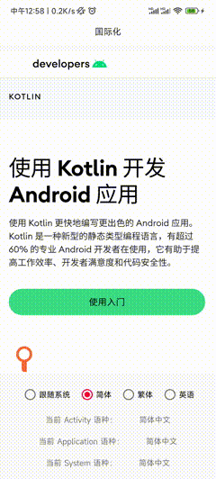

# [English Doc](README-en.md)

# 语种切换框架

* 项目地址：[Github](https://github.com/getActivity/MultiLanguages)

* 可以扫码下载 Demo 进行演示或者测试，如果扫码下载不了的，[点击此处可直接下载](https://github.com/getActivity/MultiLanguages/releases/download/10.0/MultiLanguages.apk)



#### 集成步骤

* 如果你的项目 Gradle 配置是在 `7.0 以下`，需要在 `build.gradle` 文件中加入

```groovy
allprojects {
    repositories {
        // JitPack 远程仓库：https://jitpack.io
        maven { url 'https://jitpack.io' }
    }
}
```

* 如果你的 Gradle 配置是 `7.0 及以上`，则需要在 `settings.gradle` 文件中加入

```groovy
dependencyResolutionManagement {
    repositories {
        // JitPack 远程仓库：https://jitpack.io
        maven { url 'https://jitpack.io' }
    }
}
```

* 配置完远程仓库后，在项目 app 模块下的 `build.gradle` 文件中加入远程依赖

```groovy
dependencies {
    // 语种切换框架：https://github.com/getActivity/MultiLanguages
    implementation 'com.github.getActivity:MultiLanguages:10.0'
}
```

#### 初始化框架

* 在 Application 中初始化框架

```java
public final class XxxApplication extends Application {

    @Override
    public void onCreate() {
        super.onCreate();

        // 初始化语种切换框架
        MultiLanguages.init(this);
    }
}
```

* 重写 Application 的 attachBaseContext 方法

```java
@Override
protected void attachBaseContext(Context base) {
    // 绑定语种
    super.attachBaseContext(MultiLanguages.attach(base));
}
```

* 重写**基类** BaseActivity 的 attachBaseContext 方法

```java
@Override
protected void attachBaseContext(Context newBase) {
    // 绑定语种
    super.attachBaseContext(MultiLanguages.attach(newBase));
}
```

* 只要是 Context 的子类都需要重写，Service 也雷同，这里不再赘述

* 温馨提示：Fragment 不需要重写此方法，因为它不是 Context 的子类

#### 语种设置

```java
// 设置当前的语种（返回 true 表示需要重启 App）
MultiLanguages.setAppLanguage(Context context, Locale locale);

// 获取当前的语种
MultiLanguages.getAppLanguage(Context context);

// 跟随系统语种（返回 true 表示需要重启 App）
MultiLanguages.clearAppLanguage(Context context);
```

#### 其他 API

```java
// 获取系统的语种
MultiLanguages.getSystemLanguage(Context context);
// 是否跟随系统的语种
MultiLanguages.isSystemLanguage(Context context);

// 对比两个语言是否是同一个语种（比如：中文有简体和繁体，英语有美式和英式）
MultiLanguages.equalsLanguage(Locale locale1, Locale locale2);
// 对比两个语言是否是同一个地方的（比如：中国大陆用的中文简体，中国台湾用的中文繁体）
MultiLanguages.equalsCountry(Locale locale1, Locale locale2);

// 获取某个语种下的 String
MultiLanguages.getLanguageString(Context context, Locale locale, int stringId);
// 生成某个语种下的 Resources 对象
MultiLanguages.generateLanguageResources(Context context, Locale locale);

// 更新 Context 的语种
MultiLanguages.updateAppLanguage(Context context);
// 更新 Resources 的语种
MultiLanguages.updateAppLanguage(Resources resources);

// 设置默认的语种（越早设置越好）
MultiLanguages.setDefaultLanguage(Locale locale);
```

#### 语种变化监听器

```java
// 设置语种变化监听器
MultiLanguages.setOnLanguageListener(new OnLanguageListener() {

    @Override
    public void onAppLocaleChange(Locale oldLocale, Locale newLocale) {
        Log.d("MultiLanguages", "监听到应用切换了语种，旧语种：" + oldLocale + "，新语种：" + newLocale);
    }

    @Override
    public void onSystemLocaleChange(Locale oldLocale, Locale newLocale) {
        Log.d("MultiLanguages", "监听到系统切换了语种，旧语种：" + oldLocale + "，新语种：" + newLocale + "，是否跟随系统：" + MultiLanguages.isSystemLanguage());
    }
});
```

#### 使用案例

```java
@Override
public void onClick(View v) {
    // 是否需要重启
    boolean restart;
    switch (v.getId()) {
        // 跟随系统
        case R.id.btn_language_auto:
            restart = MultiLanguages.clearAppLanguage(this);
            break;
        // 简体中文
        case R.id.btn_language_cn:
            restart = MultiLanguages.setAppLanguage(this, LocaleContract.getSimplifiedChineseLocale());
            break;
        // 繁体中文
        case R.id.btn_language_tw:
            restart = MultiLanguages.setAppLanguage(this, LocaleContract.getTraditionalChineseLocale());
            break;
        // 英语
        case R.id.btn_language_en:
            restart = MultiLanguages.setAppLanguage(this, LocaleContract.getEnglishLocale());
            break;
        default:
            restart = false;
            break;
    }

    if (restart) {
        // 我们可以充分运用 Activity 跳转动画，在跳转的时候设置一个渐变的效果
        Intent intent = new Intent(this, MainActivity.class);
        // Github 地址：https://github.com/getActivity/MultiLanguages/issues/55
        intent.addFlags(Intent.FLAG_ACTIVITY_NEW_TASK | Intent.FLAG_ACTIVITY_CLEAR_TASK);
        startActivity(intent);
        overridePendingTransition(R.anim.activity_alpha_in, R.anim.activity_alpha_out);
        finish();
    }
}
```

## [常见疑问请点击此处查看](HelpDoc.md)

#### 其他资源：[语言代码列表大全](https://github.com/championswimmer/android-locales)

#### 作者的其他开源项目

* 安卓技术中台：[AndroidProject](https://github.com/getActivity/AndroidProject)  

* 安卓技术中台 Kt 版：[AndroidProject-Kotlin](https://github.com/getActivity/AndroidProject-Kotlin)  

* 权限框架：[XXPermissions](https://github.com/getActivity/XXPermissions)  

* 吐司框架：[Toaster](https://github.com/getActivity/Toaster)  

* 网络框架：[EasyHttp](https://github.com/getActivity/EasyHttp)  

* 标题栏框架：[TitleBar](https://github.com/getActivity/TitleBar)  

* 悬浮窗框架：[EasyWindow](https://github.com/getActivity/EasyWindow)  

* 设备兼容框架：[DeviceCompat](https://github.com/getActivity/DeviceCompat)  

* Shape 框架：[ShapeView](https://github.com/getActivity/ShapeView)  

* Gson 解析容错：[GsonFactory](https://github.com/getActivity/GsonFactory)  

* 日志查看框架：[Logcat](https://github.com/getActivity/Logcat)  

* Android 版本适配：[AndroidVersionAdapter](https://github.com/getActivity/AndroidVersionAdapter)  

* Android 代码规范：[AndroidCodeStandard](https://github.com/getActivity/AndroidCodeStandard)  

* Android 资源大汇总：[AndroidIndex](https://github.com/getActivity/AndroidIndex)  

* Android 开源排行榜：[AndroidGithubBoss](https://github.com/getActivity/AndroidGithubBoss)  

* Studio 精品插件：[StudioPlugins](https://github.com/getActivity/StudioPlugins)  

* 表情包大集合：[EmojiPackage](https://github.com/getActivity/EmojiPackage)  

* AI 资源大汇总：[AiIndex](https://github.com/getActivity/AiIndex)  

* 省市区 Json 数据：[ProvinceJson](https://github.com/getActivity/ProvinceJson)  

* Markdown 语法文档：[MarkdownDoc](https://github.com/getActivity/MarkdownDoc)  

#### 微信公众号：Android轮子哥


#### Android 技术 Q 群：10047167

#### 如果您觉得我的开源库帮你节省了大量的开发时间，请扫描下方的二维码随意打赏，要是能打赏个 10.24 :monkey_face:就太:thumbsup:了。您的支持将鼓励我继续创作:octocat:（[点击查看捐赠列表](https://github.com/getActivity/Donate)）

 

## License

```text
Copyright 2019 Huang JinQun

Licensed under the Apache License, Version 2.0 (the "License");
you may not use this file except in compliance with the License.
You may obtain a copy of the License at

   http://www.apache.org/licenses/LICENSE-2.0

Unless required by applicable law or agreed to in writing, software
distributed under the License is distributed on an "AS IS" BASIS,
WITHOUT WARRANTIES OR CONDITIONS OF ANY KIND, either express or implied.
See the License for the specific language governing permissions and
limitations under the License.
```