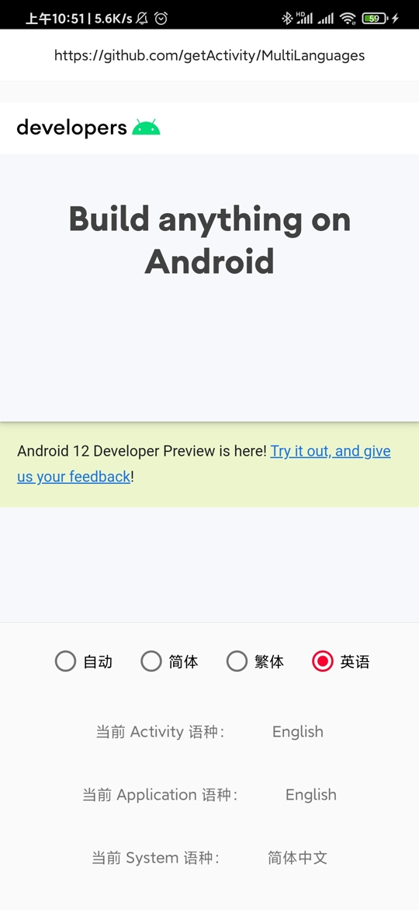

# 多语种适配框架

* 码云地址：[Gitee](https://gitee.com/getActivity/MultiLanguages)

* [点击此处下载Demo](MultiLanguages.apk)



#### 集成步骤

```groovy
dependencies {
    // 国际化框架：https://github.com/getActivity/MultiLanguages
    implementation 'com.hjq:language:6.0'
}
```

#### 初始化框架

* 在 Application 中初始化框架

```java
public final class XxxApplication extends Application {

    @Override
    public void onCreate() {
        super.onCreate();
        // 初始化多语种框架（自动适配第三方库中 Activity 语种）
        MultiLanguages.init(this);
    }
}

```

* 重写 Application 的 attachBaseContext 方法

```java
@Override
protected void attachBaseContext(Context base) {
    // 国际化适配（绑定语种）
    super.attachBaseContext(MultiLanguages.attach(base));
}
```

* 重写**基类** BaseActivity 的 attachBaseContext 方法

```java
@Override
protected void attachBaseContext(Context newBase) {
    // 国际化适配（绑定语种）
    super.attachBaseContext(MultiLanguages.attach(newBase));
}
```

* 只要是 Context 的子类都需要重写，Service 也雷同，这里不再赘述

#### 语种设置

```java
// 设置当前的语种（返回 true 需要重启 App）
MultiLanguages.setAppLanguage(Context context, Locale locale);

// 获取当前的语种
MultiLanguages.getAppLanguage();
```

#### 其他 API

```java
// 将 App 语种设置为系统语种（返回 true 需要重启 App）
MultiLanguages.setSystemLanguage(Context context);
// 获取系统的语种
MultiLanguages.getSystemLanguage();

// 对比两个语言是否是同一个语种（比如：中文的简体和繁体，英语的美式和英式）
MultiLanguages.equalsLanguage(Locale locale1, Locale locale2);
// 对比两个语言是否是同一个地方的（比如：中国大陆用的中文简体，中国台湾用的中文繁体）
MultiLanguages.equalsCountry(Locale locale1, Locale locale2);

// 获取某个语种下的 String
MultiLanguages.getLanguageString(Context context, Locale locale, int stringId);
// 获取某个语种下的 Resources 对象
MultiLanguages.getLanguageResources(Context context, Locale locale);

// 更新 Context 的语种
MultiLanguages.updateAppLanguage(Context context);
// 更新 Resources 的语种
MultiLanguages.updateAppLanguage(Resources resources);
```

#### 语种变化监听器

```java
// 设置语种变化监听器
MultiLanguages.setOnLanguageListener(new OnLanguageListener() {

    @Override
    public void onAppLocaleChange(Locale oldLocale, Locale newLocale) {
        Log.d("MultiLanguages", "监听到应用切换了语种，旧语种：" + oldLocale + "，新语种：" + newLocale);
    }

    @Override
    public void onSystemLocaleChange(Locale oldLocale, Locale newLocale) {
        Log.d("MultiLanguages", "监听到系统切换了语种，旧语种：" + oldLocale + "，新语种：" + newLocale);
    }
});
```

#### 使用案例

```java
@Override
public void onClick(View v) {
    // 是否需要重启
    boolean restart;
    switch (v.getId()) {
        // 跟随系统
        case R.id.btn_language_auto:
            restart = MultiLanguages.setSystemLanguage(this);
            break;
        // 简体中文
        case R.id.btn_language_cn:
            restart = MultiLanguages.setAppLanguage(this, Locale.CHINA);
            break;
        // 繁体中文
        case R.id.btn_language_tw:
            restart = MultiLanguages.setAppLanguage(this, Locale.TAIWAN);
            break;
        // 英语
        case R.id.btn_language_en:
            restart = MultiLanguages.setAppLanguage(this, Locale.ENGLISH);
            break;
        default:
            restart = false;
            break;
    }

    if (restart) {
        // 我们可以充分运用 Activity 跳转动画，在跳转的时候设置一个渐变的效果
        startActivity(new Intent(this, LanguageActivity.class));
        overridePendingTransition(R.anim.activity_alpha_in, R.anim.activity_alpha_out);
        finish();
    }
}
```

#### WebView 导致语种失效的解决方案

* 由于 WebView 初始化会修改 Activity 语种配置，间接导致 Activity 语种会被还原回去，所以需要你手动重写 WebView 对这个问题进行修复

```java
public final class LanguagesWebView extends WebView {

    public LanguagesWebView(@NonNull Context context) {
        this(context, null);
    }

    public LanguagesWebView(@NonNull Context context, @Nullable AttributeSet attrs) {
        this(context, attrs, 0);
    }

    public LanguagesWebView(@NonNull Context context, @Nullable AttributeSet attrs, int defStyleAttr) {
        super(context, attrs, defStyleAttr);
        // 修复 WebView 初始化时会修改 Activity 语种配置的问题
        MultiLanguages.updateAppLanguage(context);
    }
}
```

#### 其他资源：[语言代码列表大全](https://github.com/championswimmer/android-locales)

#### 作者的其他开源项目

* 安卓技术中台：[AndroidProject](https://github.com/getActivity/AndroidProject)

* 网络框架：[EasyHttp](https://github.com/getActivity/EasyHttp)

* 权限框架：[XXPermissions](https://github.com/getActivity/XXPermissions)

* 吐司框架：[ToastUtils](https://github.com/getActivity/ToastUtils)

* 标题栏框架：[TitleBar](https://github.com/getActivity/TitleBar)

* 悬浮窗框架：[XToast](https://github.com/getActivity/XToast)

* Gson 解析容错：[GsonFactory](https://github.com/getActivity/GsonFactory)

* 日志查看框架：[Logcat](https://github.com/getActivity/Logcat)

#### Android技术讨论Q群：78797078

#### 微信公众号：Android轮子哥


#### 如果您觉得我的开源库帮你节省了大量的开发时间，请扫描下方的二维码随意打赏，要是能打赏个 10.24 :monkey_face:就太:thumbsup:了。您的支持将鼓励我继续创作:octocat:

 

#### [点击查看捐赠列表](https://github.com/getActivity/Donate)

## License

```text
Copyright 2019 Huang JinQun

Licensed under the Apache License, Version 2.0 (the "License");
you may not use this file except in compliance with the License.
You may obtain a copy of the License at

   http://www.apache.org/licenses/LICENSE-2.0

Unless required by applicable law or agreed to in writing, software
distributed under the License is distributed on an "AS IS" BASIS,
WITHOUT WARRANTIES OR CONDITIONS OF ANY KIND, either express or implied.
See the License for the specific language governing permissions and
limitations under the License.
```
